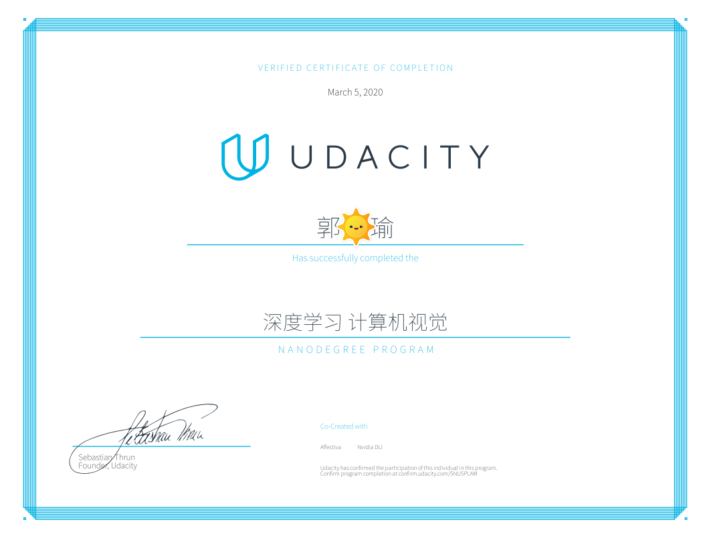

# Udacity - Computer Vision Nanodegree

# Udacity计算机视觉纳米学位项目

1. [脸部关键点检测](https://github.com/udacity/Facial-Keypoint-Detection)

2. [自动生成图像说明](https://github.com/udacity/Automatic-Image-Captioning)

3. [地标检测与跟踪(SLAM)](https://github.com/udacity/Landmark-Detection&Tracking)

